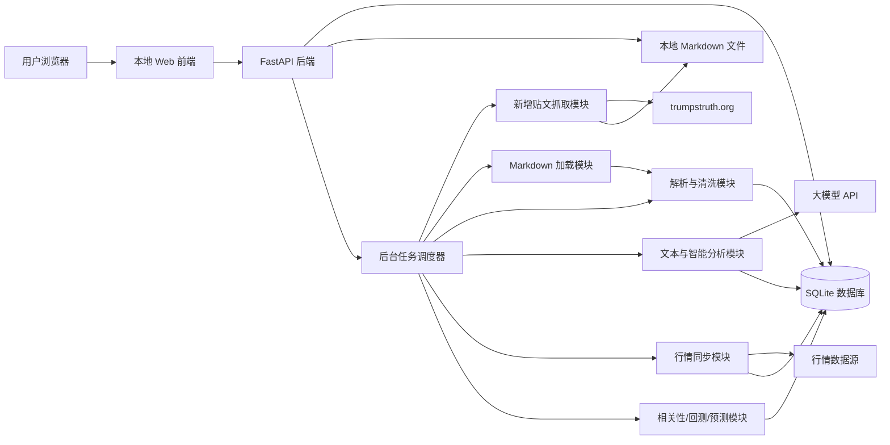
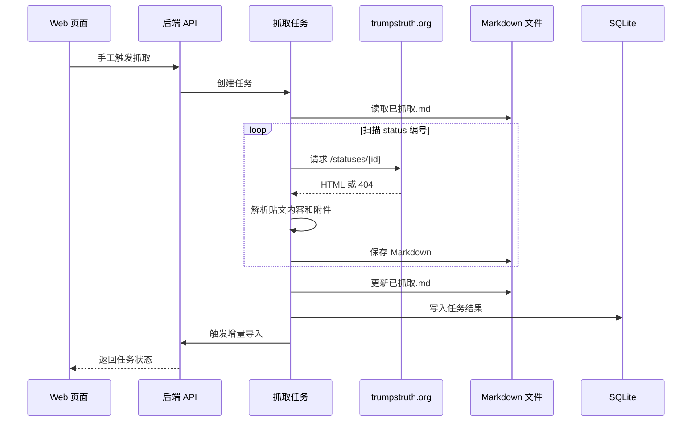
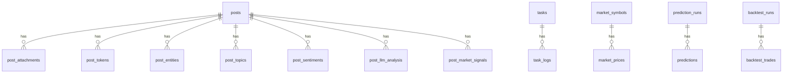
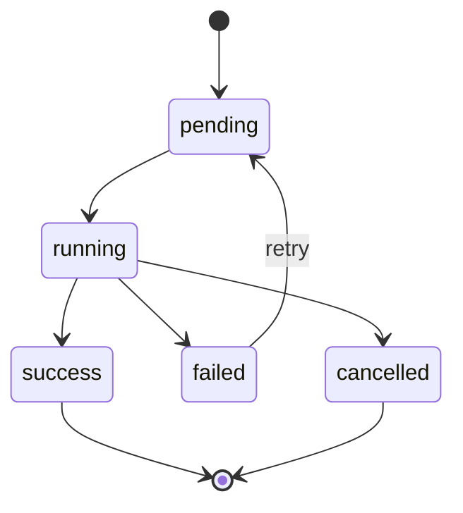

# 特朗普真实社交贴文分析系统设计说明书

- 文档版本：v0.1
- 编写日期：2026-06-11
- 依据文档：[特朗普真实社交贴文分析系统需求规格说明书.md](特朗普真实社交贴文分析系统需求规格说明书.md)
- 用户确认事项：本地 Web 应用、SQLite 数据库、允许接入大模型 API、美股相关性/回测/预测均需要、每日自动抓取并支持 Web 手工触发

## 1. 设计目标

本系统设计目标是把当前目录下已有的 Truth Social 贴文 Markdown 文件，以及后续每日新增抓取内容，统一纳入一个本地 Web 分析系统。系统需要完成贴文采集、Markdown 解析、SQLite 入库、文本分析、大模型智能分析、股票行情对齐、相关性分析、回测和预测，并通过浏览器界面提供检索、统计、图表和任务管理能力。

设计重点：

1. 本地优先：默认在本机运行，不依赖公网部署。
2. 数据可追溯：每条分析结果都能追溯到原始 Markdown、原始链接和分析任务。
3. 增量可重复：导入、抓取和分析任务可以重复执行，不产生重复数据。
4. 分层解耦：抓取、解析、存储、分析、预测和展示模块彼此独立，方便后续替换。
5. 研究用途：美股预测和回测结果仅作为研究分析输出，不提供自动交易能力。

## 2. 总体架构

### 2.1 架构风格

系统采用本地前后端分离架构：

- 前端：本地 Web 应用，运行在浏览器中。
- 后端：Python Web API 服务，负责业务逻辑、任务调度和数据访问。
- 数据库：SQLite 本地文件数据库。
- 后台任务：内置调度器执行每日抓取、导入、分析和行情同步。
- 外部接口：可配置的大模型 API、行情数据 API、`trumpstruth.org` 抓取来源。

### 2.2 推荐技术栈

| 层级 | 推荐技术 | 说明 |
| --- | --- | --- |
| 前端 | React + Vite + TypeScript | 适合构建交互式本地 Web 分析界面 |
| UI 组件 | Ant Design 或 shadcn/ui | 表格、筛选、表单、弹窗和任务面板较成熟 |
| 图表 | ECharts | 适合中文数据看板、时间序列、词频和相关性图表 |
| 后端 | Python + FastAPI | API 清晰，便于与分析代码共用 Python 生态 |
| ORM | SQLAlchemy | 管理 SQLite 表结构和查询 |
| 数据迁移 | Alembic | 支持后续数据库结构升级 |
| 后台任务 | APScheduler | 支持每日定时任务和 Web 手工触发 |
| 文本处理 | regex、spaCy、scikit-learn | 基础解析、实体识别、特征工程 |
| 预测建模 | pandas、statsmodels、scikit-learn | 相关性、回测、传统机器学习预测 |
| 大模型适配 | LLM Provider Adapter | 封装不同大模型供应商，避免业务代码绑定某一家 |
| 配置 | `.env` + YAML/JSON | 保存路径、任务时间、API Key 和模型参数 |

### 2.3 架构图



## 3. 系统模块设计

### 3.1 前端 Web 应用

前端负责本地交互展示，不直接读取文件和数据库，所有数据通过后端 API 获取。

主要页面：

| 页面 | 路由 | 说明 |
| --- | --- | --- |
| 仪表盘 | `/` | 展示贴文总览、最新贴文、趋势、任务状态 |
| 贴文列表 | `/posts` | 搜索、筛选、分页浏览贴文 |
| 贴文详情 | `/posts/:id` | 展示原文、元数据、附件和分析结果 |
| 文本分析 | `/analysis/text` | 词频、主题、国家、实体、情绪、中国相关性 |
| 对华议题 | `/analysis/china` | 中国相关贴文专题分析 |
| 股市分析 | `/analysis/market` | 美股相关性、回测、预测结果 |
| 事件聚合 | `/events` | 按主题和时间聚合的事件列表 |
| 任务中心 | `/tasks` | 导入、抓取、分析、行情同步任务状态 |
| 系统配置 | `/settings` | 数据目录、任务时间、模型和行情源配置 |

前端交互原则：

1. 所有筛选条件应体现在 URL query 中，方便刷新和分享本地链接。
2. 列表页默认按发布时间倒序。
3. 图表页支持时间范围、主题、国家、是否转发等筛选。
4. 手工触发抓取、导入和分析任务时，应显示任务进度、日志摘要和失败原因。
5. 美股预测页面必须显示“研究用途，不构成投资建议”的固定提示。

### 3.2 后端 API 服务

后端提供统一业务入口：

1. 管理 SQLite 数据访问。
2. 执行 Markdown 扫描、解析和入库。
3. 调用抓取、分析、大模型和行情模块。
4. 提供前端需要的查询、图表和任务接口。
5. 管理每日自动任务。

后端目录建议：

```text
backend/
  app/
    main.py
    core/
      config.py
      logging.py
      security.py
      scheduler.py
    db/
      session.py
      models.py
      migrations/
    routers/
      posts.py
      dashboard.py
      analysis.py
      market.py
      tasks.py
      settings.py
    services/
      crawler_service.py
      markdown_loader.py
      markdown_parser.py
      post_importer.py
      text_analyzer.py
      llm_analyzer.py
      market_data_service.py
      backtest_service.py
      prediction_service.py
      report_service.py
    schemas/
      post.py
      analysis.py
      task.py
      market.py
    repositories/
      post_repo.py
      task_repo.py
      analysis_repo.py
  tests/
frontend/
  src/
    pages/
    components/
    api/
    charts/
    stores/
data/
  app.sqlite3
  logs/
  cache/
  exports/
config/
  app.yaml
```

### 3.3 新增贴文抓取模块

抓取模块基于当前已有逻辑扩展：读取 `已抓取.md` 中的数字作为当前最大来源编号，从 `https://trumpstruth.org/statuses/{id}` 扫描后续编号，抓取非 404 页面并保存为 Markdown。

设计要求：

1. 每日自动触发一次，默认时间可配置。
2. 支持 Web 任务中心手工触发。
3. 支持配置每次扫描范围，例如 `max + 1` 到 `max + 100`。
4. 成功抓取后，将最大成功来源编号写回 `已抓取.md`。
5. 抓取到的文件应保存到按年份和月份划分的目录中。
6. 文件名应使用发布时间和标题生成，并处理非法文件名字符。
7. 抓取失败、解析失败、网络失败不能中断整个批次。
8. 抓取结果应自动进入导入和分析流程。

抓取流程：



### 3.4 Markdown 加载与解析模块

加载模块负责扫描文件，解析模块负责从 Markdown 提取结构化字段。

关键设计：

1. 使用文件路径、修改时间、大小和 SHA-256 哈希判断文件是否变化。
2. 使用 Truth Social status ID 作为首选去重键。
3. 对无 status ID 的贴文，使用原始链接、来源链接和文件哈希作为补充去重。
4. 标准格式优先采用规则解析，异常格式进入启发式解析。
5. 解析失败的文件记录到 `parse_errors`，但不影响其他文件。

解析结果对象：

```text
ParsedPost
  title
  author_name
  author_handle
  published_at_raw
  published_at_utc
  original_url
  truth_status_id
  source_url
  source_status_id
  content_raw
  content_clean
  attachments[]
  file_path
  file_hash
  parse_warnings[]
```

### 3.5 贴文分析模块

贴文分析分为规则分析、统计分析和大模型分析三层。

规则分析：

- 分词。
- 停用词过滤。
- hashtag、@mention、URL 提取。
- 国家和地区词典匹配。
- 中国相关关键词匹配。
- 美股相关关键词匹配。

统计分析：

- 词频排行。
- n-gram 统计。
- 时间序列聚合。
- 共现分析。
- 主题趋势。
- 情绪趋势。

大模型分析：

- 中文摘要。
- 主题分类。
- 实体识别补充。
- 对华相关性解释。
- 事件聚合说明。
- 重要贴文解读。

大模型调用设计：

1. 通过 `llm_provider` 适配层调用，不在业务代码中硬编码供应商。
2. Prompt 模板集中放在 `prompts/` 目录。
3. 请求和响应保存摘要日志，避免保存 API Key。
4. 分析结果保存模型名称、参数、Prompt 版本和生成时间。
5. 对同一贴文和同一 Prompt 版本做缓存，避免重复调用。

### 3.6 美股分析与预测模块

美股模块分为四条链路：识别、行情同步、相关性/回测、预测。

#### 3.6.1 贴文识别

系统根据关键词、主题和大模型分类识别美股相关贴文。候选信号包括：

- stocks、stock market、NASDAQ、Dow、S&P、Wall Street。
- jobs report、inflation、tariff、interest rate、Fed、GDP。
- company、investment、trade、oil、energy、chip 等经济金融词。
- 明确提及个股、指数、行业或经济数据。

#### 3.6.2 行情数据同步

行情数据采用适配器模式，先定义统一接口，再接入具体数据源。

数据范围：

- 主要指数：S&P 500、NASDAQ Composite、Dow Jones。
- 可选 ETF：SPY、QQQ、DIA。
- 可选个股：由配置文件指定。
- 可选宏观字段：美元指数、VIX、美国国债收益率等。

保存粒度：

- 日线 OHLCV。
- 可选分钟级数据，若数据源支持且后续确有必要再扩展。

#### 3.6.3 相关性分析

相关性分析的基本方法：

1. 将贴文发布时间转换为美股交易日。
2. 根据发布时间判断落在哪个交易窗口，例如盘前、盘中、盘后、非交易日。
3. 构造事件窗口，例如 T+0、T+1、T+3、T+5。
4. 统计窗口内指数或标的收益率。
5. 比较相关贴文与普通贴文、有无特定主题、有无强烈情绪之间的收益差异。
6. 输出相关系数、均值差、置信区间和样本数量。

#### 3.6.4 回测

回测模块用于评估基于贴文信号的简单策略。

示例策略：

- 当出现正向经济/股市贴文时，下一交易日买入指数 ETF，持有 N 天。
- 当出现负向通胀/关税/战争相关贴文时，降低仓位或做空指数。
- 当某主题情绪强度超过阈值时触发交易信号。

回测输出：

- 总收益。
- 年化收益。
- 最大回撤。
- 胜率。
- 夏普比率。
- 交易次数。
- 持仓天数。
- 与基准买入持有对比。

限制：

1. 第一阶段只做无杠杆、多头或空仓策略。
2. 默认加入交易成本和滑点参数。
3. 回测结果必须显示样本数量和时间范围。
4. 页面固定提示结果不构成投资建议。

#### 3.6.5 预测

预测模块输出研究性预测，不连接真实交易。

预测目标：

- 下一交易日指数方向：上涨、下跌、持平。
- 未来 N 日收益率区间。
- 波动率变化方向。
- 风险等级。

特征设计：

- 贴文数量特征：近 1/3/7 日贴文数。
- 主题特征：经济、战争、关税、中国、就业等主题计数。
- 情绪特征：情绪均值、强度最大值、负面比例。
- 实体特征：国家、公司、指数、政策共现。
- 文本向量特征：TF-IDF 或大模型 embedding。
- 市场滞后特征：前 N 日收益率、成交量、波动率。
- 日历特征：星期、节假日、财报季、重大经济数据日。

模型策略：

1. Baseline：永远预测多数类或跟随前一日方向。
2. 传统模型：逻辑回归、随机森林、梯度提升、线性回归。
3. 时间序列模型：ARIMA/VAR 或带外生变量的回归模型。
4. 大模型辅助：只用于解释和特征归纳，不直接作为唯一预测依据。

评估指标：

- 分类准确率。
- Precision、Recall、F1。
- AUC。
- 方向命中率。
- MAE、RMSE。
- 分年度滚动验证表现。
- 与无贴文特征模型对比的增益。

防止过拟合：

- 严格按时间切分训练集、验证集和测试集。
- 禁止使用未来行情和未来贴文信息。
- 所有特征必须记录生成时间窗口。
- 预测报告显示训练区间、测试区间和特征版本。

## 4. 数据库设计

### 4.1 表关系概览



### 4.2 核心表

#### posts

| 字段 | 类型 | 说明 |
| --- | --- | --- |
| id | integer pk | 内部主键 |
| status_id | text unique nullable | Truth Social status ID |
| source_status_id | integer nullable | trumpstruth.org 来源编号 |
| title | text | 标题 |
| author_name | text | 作者名称 |
| author_handle | text | 作者账号 |
| published_at_raw | text | 原始时间字符串 |
| published_at_utc | datetime | UTC 发布时间 |
| published_at_et | datetime | 美国东部时间 |
| published_date | date | 发布日期 |
| original_url | text | Truth Social 原始链接 |
| source_url | text | 抓取来源链接 |
| content_raw | text | 原始正文 |
| content_clean | text | 清洗正文 |
| language | text | 语言 |
| is_retruth | boolean | 是否转发 |
| has_attachment | boolean | 是否包含附件 |
| word_count | integer | 单词数 |
| char_count | integer | 字符数 |
| file_path | text | Markdown 文件路径 |
| file_hash | text | 文件哈希 |
| parse_status | text | success、partial、failed |
| created_at | datetime | 入库时间 |
| updated_at | datetime | 更新时间 |

索引：

- `idx_posts_published_at_utc`
- `idx_posts_published_date`
- `idx_posts_source_status_id`
- `idx_posts_file_hash`
- SQLite FTS5 全文索引：`title`、`content_clean`

#### post_attachments

| 字段 | 类型 | 说明 |
| --- | --- | --- |
| id | integer pk | 主键 |
| post_id | integer fk | 贴文 ID |
| attachment_type | text | image、video、link、none、unknown |
| url | text | 附件 URL |
| local_path | text | 本地路径 |
| description | text | 描述 |
| raw_text | text | 原始 Markdown 附件内容 |

#### post_topics

| 字段 | 类型 | 说明 |
| --- | --- | --- |
| id | integer pk | 主键 |
| post_id | integer fk | 贴文 ID |
| topic | text | 主题 |
| confidence | real | 置信度 |
| source | text | rule、llm、manual |
| reason | text | 判断依据 |

#### post_entities

| 字段 | 类型 | 说明 |
| --- | --- | --- |
| id | integer pk | 主键 |
| post_id | integer fk | 贴文 ID |
| entity_text | text | 原始实体 |
| entity_type | text | person、country、org、company、market、policy |
| normalized_name | text | 标准化名称 |
| confidence | real | 置信度 |
| source | text | rule、nlp、llm |

#### post_china_relevance

| 字段 | 类型 | 说明 |
| --- | --- | --- |
| post_id | integer pk fk | 贴文 ID |
| is_related | boolean | 是否中国相关 |
| score | real | 相关性分数 |
| matched_keywords | text/json | 命中关键词 |
| reason | text | 判断理由 |
| source | text | rule、llm、hybrid |
| analyzed_at | datetime | 分析时间 |

#### post_sentiments

| 字段 | 类型 | 说明 |
| --- | --- | --- |
| id | integer pk | 主键 |
| post_id | integer fk | 贴文 ID |
| polarity | text | positive、neutral、negative |
| score | real | 情绪分数 |
| intensity | real | 强度 |
| tones | text/json | 语气标签 |
| source | text | rule、model、llm |

#### tasks

| 字段 | 类型 | 说明 |
| --- | --- | --- |
| id | integer pk | 任务 ID |
| task_type | text | crawl、import、analyze、market_sync、backtest、predict |
| status | text | pending、running、success、failed、cancelled |
| trigger_type | text | schedule、manual、startup、chained |
| parameters | text/json | 参数 |
| started_at | datetime | 开始时间 |
| finished_at | datetime | 结束时间 |
| summary | text/json | 汇总结果 |
| error_message | text | 错误信息 |

### 4.3 美股相关表

#### market_symbols

| 字段 | 类型 | 说明 |
| --- | --- | --- |
| id | integer pk | 主键 |
| symbol | text unique | 标的代码 |
| name | text | 名称 |
| asset_type | text | index、etf、stock、macro |
| exchange | text | 交易所 |
| timezone | text | 时区 |
| enabled | boolean | 是否启用 |

#### market_prices

| 字段 | 类型 | 说明 |
| --- | --- | --- |
| id | integer pk | 主键 |
| symbol_id | integer fk | 标的 ID |
| trade_date | date | 交易日 |
| open | real | 开盘价 |
| high | real | 最高价 |
| low | real | 最低价 |
| close | real | 收盘价 |
| adjusted_close | real | 复权收盘价 |
| volume | integer | 成交量 |
| data_source | text | 数据源 |

唯一约束：`symbol_id + trade_date + data_source`

#### post_market_signals

| 字段 | 类型 | 说明 |
| --- | --- | --- |
| id | integer pk | 主键 |
| post_id | integer fk | 贴文 ID |
| signal_type | text | bullish、bearish、risk、neutral |
| signal_score | real | 信号强度 |
| related_symbols | text/json | 相关标的 |
| event_window | text | T0、T1、T3、T5 |
| reason | text | 依据 |
| source | text | rule、llm、model |

#### backtest_runs

| 字段 | 类型 | 说明 |
| --- | --- | --- |
| id | integer pk | 主键 |
| name | text | 回测名称 |
| strategy_config | text/json | 策略参数 |
| start_date | date | 开始日期 |
| end_date | date | 结束日期 |
| benchmark_symbol | text | 基准 |
| total_return | real | 总收益 |
| annual_return | real | 年化收益 |
| max_drawdown | real | 最大回撤 |
| sharpe_ratio | real | 夏普比率 |
| win_rate | real | 胜率 |
| trade_count | integer | 交易次数 |
| created_at | datetime | 创建时间 |

#### predictions

| 字段 | 类型 | 说明 |
| --- | --- | --- |
| id | integer pk | 主键 |
| prediction_run_id | integer fk | 预测批次 |
| symbol | text | 标的 |
| target_date | date | 预测目标日期 |
| horizon_days | integer | 预测周期 |
| predicted_direction | text | up、down、flat |
| predicted_return | real | 预测收益 |
| confidence | real | 置信度 |
| feature_snapshot | text/json | 特征快照 |
| actual_direction | text | 实际方向，回填 |
| actual_return | real | 实际收益，回填 |

## 5. API 设计

### 5.1 贴文接口

| 方法 | 路径 | 说明 |
| --- | --- | --- |
| GET | `/api/posts` | 贴文列表，支持搜索和筛选 |
| GET | `/api/posts/{id}` | 贴文详情 |
| GET | `/api/posts/{id}/analysis` | 单篇贴文分析结果 |
| GET | `/api/posts/export` | 导出筛选结果 |

常用查询参数：

- `q`
- `date_from`
- `date_to`
- `topic`
- `country`
- `china_related`
- `is_retruth`
- `has_attachment`
- `page`
- `page_size`

### 5.2 仪表盘接口

| 方法 | 路径 | 说明 |
| --- | --- | --- |
| GET | `/api/dashboard/summary` | 总览指标 |
| GET | `/api/dashboard/timeline` | 贴文数量时间线 |
| GET | `/api/dashboard/top-entities` | 高频实体 |
| GET | `/api/dashboard/recent-posts` | 最新贴文 |
| GET | `/api/dashboard/task-status` | 最近任务状态 |

### 5.3 分析接口

| 方法 | 路径 | 说明 |
| --- | --- | --- |
| GET | `/api/analysis/word-frequency` | 词频排行 |
| GET | `/api/analysis/topics/trend` | 主题趋势 |
| GET | `/api/analysis/countries` | 国家提及分析 |
| GET | `/api/analysis/china` | 对华议题分析 |
| GET | `/api/analysis/sentiment` | 情绪趋势 |
| POST | `/api/analysis/summary` | 生成指定范围智能摘要 |

### 5.4 任务接口

| 方法 | 路径 | 说明 |
| --- | --- | --- |
| GET | `/api/tasks` | 任务列表 |
| GET | `/api/tasks/{id}` | 任务详情 |
| GET | `/api/tasks/{id}/logs` | 任务日志 |
| POST | `/api/tasks/crawl` | 手工触发新增抓取 |
| POST | `/api/tasks/import` | 手工触发 Markdown 导入 |
| POST | `/api/tasks/analyze` | 手工触发分析 |
| POST | `/api/tasks/market-sync` | 手工触发行情同步 |
| POST | `/api/tasks/backtest` | 手工触发回测 |
| POST | `/api/tasks/predict` | 手工触发预测 |

### 5.5 美股接口

| 方法 | 路径 | 说明 |
| --- | --- | --- |
| GET | `/api/market/symbols` | 标的列表 |
| GET | `/api/market/prices` | 行情数据 |
| GET | `/api/market/correlation` | 相关性结果 |
| GET | `/api/market/backtests` | 回测列表 |
| GET | `/api/market/backtests/{id}` | 回测详情 |
| GET | `/api/market/predictions` | 预测结果 |
| GET | `/api/market/predictions/evaluation` | 预测表现评估 |

### 5.6 配置接口

| 方法 | 路径 | 说明 |
| --- | --- | --- |
| GET | `/api/settings` | 读取系统配置 |
| PUT | `/api/settings` | 更新系统配置 |
| GET | `/api/settings/health` | 检查数据目录、数据库、大模型和行情源状态 |

## 6. 后台任务设计

### 6.1 任务类型

| 任务 | 触发方式 | 说明 |
| --- | --- | --- |
| crawl | 每日自动、Web 手工 | 扫描 trumpstruth.org 新编号并保存 Markdown |
| import | crawl 后自动、Web 手工 | 扫描 Markdown 并入库 |
| analyze | import 后自动、Web 手工 | 执行文本、主题、实体、情绪和大模型分析 |
| market_sync | 每日自动、Web 手工 | 同步行情数据 |
| backtest | Web 手工、定期 | 根据配置运行回测 |
| predict | 每日自动、Web 手工 | 生成下一交易日或未来 N 日预测 |

### 6.2 默认每日任务链

建议默认任务链：

1. 06:30 本地时间：抓取新增贴文。
2. 抓取成功后：自动执行增量导入。
3. 导入成功后：自动执行增量文本分析。
4. 07:00 本地时间：同步上一交易日行情数据。
5. 行情同步后：更新相关性和预测评估。
6. 07:10 本地时间：生成下一交易日预测。

具体时间应在系统配置中可修改。

### 6.3 并发和互斥

1. 同一类型任务同一时间只允许一个实例运行。
2. 抓取任务和导入任务不能同时修改同一批 Markdown 文件。
3. 分析任务可以按贴文范围分批处理，但写库需要事务保护。
4. 预测任务必须固定数据截止时间，避免运行中数据变化导致不可复现。

### 6.4 任务状态机



## 7. 配置设计

### 7.1 配置文件示例

```yaml
app:
  host: "127.0.0.1"
  port: 8000
  timezone: "Asia/Shanghai"

paths:
  data_root: "E:/Sync2NAS/坚果云同步/ObsidianVault/资讯/特朗普真实社交"
  database: "data/app.sqlite3"
  logs: "data/logs"
  exports: "data/exports"

crawler:
  enabled: true
  progress_file: "已抓取.md"
  base_url: "https://trumpstruth.org/statuses"
  batch_size: 100
  daily_time: "06:30"
  request_timeout_seconds: 20
  max_retries: 3

analysis:
  default_language: "en"
  enable_llm: true
  llm_provider: "default"
  prompt_version: "v1"
  cache_llm_results: true

market:
  enabled: true
  daily_sync_time: "07:00"
  symbols: ["SPY", "QQQ", "DIA"]
  prediction_horizons: [1, 3, 5]
  transaction_cost_bps: 5

scheduler:
  enabled: true
  run_on_startup: false
```

### 7.2 密钥管理

API Key 不写入普通配置文件，使用 `.env` 或系统环境变量：

```text
LLM_API_KEY=
MARKET_DATA_API_KEY=
```

后端日志不得输出完整 API Key。

## 8. 数据处理流程

### 8.1 全量初始化

1. 创建 SQLite 数据库和表结构。
2. 扫描当前目录历史 Markdown 文件。
3. 过滤非贴文文件。
4. 解析并写入 `posts`、`post_attachments`。
5. 执行基础文本分析。
6. 对待分析贴文执行大模型分析。
7. 同步历史行情数据。
8. 计算历史相关性、回测和预测评估。
9. 前端展示初始化结果。

### 8.2 每日增量

1. 读取 `已抓取.md`。
2. 抓取后续编号。
3. 保存新增 Markdown。
4. 更新 `已抓取.md`。
5. 增量导入新增 Markdown。
6. 对新增贴文执行分析。
7. 同步最新行情。
8. 更新市场相关分析和预测。

### 8.3 手工触发

Web 任务中心允许用户单独触发：

- 只抓取。
- 只导入。
- 只分析。
- 同步行情。
- 运行某个回测策略。
- 生成预测。

手工触发时，用户可选择参数，例如扫描范围、时间区间、是否覆盖已有分析结果。

## 9. 前端界面设计

### 9.1 仪表盘

核心区域：

- 顶部指标条：总贴文数、最新贴文、覆盖日期、今日新增、中国相关占比。
- 时间序列图：每日贴文数量和主题热度。
- 高频排行：关键词、国家、人物、组织。
- 最近任务：抓取、导入、分析、行情同步状态。
- 最新贴文：展示最近 10 条。

### 9.2 贴文列表

列表列设计：

- 发布时间。
- 标题。
- 正文摘要。
- 主题。
- 国家。
- 中国相关。
- 情绪。
- 是否转发。
- 原始链接。

筛选器：

- 关键词。
- 日期范围。
- 主题。
- 国家。
- 情绪。
- 中国相关性。
- 是否美股相关。
- 是否含附件。

### 9.3 贴文详情

详情页分区：

- 原文区：标题、作者、时间、正文、附件和链接。
- 解析区：status ID、来源 ID、文件路径、解析状态。
- 分析区：关键词、主题、实体、国家、情绪、对华相关依据。
- 市场区：若美股相关，展示事件窗口收益和信号解释。

### 9.4 股市分析页

页面分为四个 Tab：

- 相关性：主题/情绪/国家与指数收益之间的统计关系。
- 事件窗口：单条或一组贴文发布后 T+0/T+1/T+3/T+5 收益表现。
- 回测：策略配置、收益曲线、风险指标、交易明细。
- 预测：未来 N 日预测、置信度、历史评估和特征贡献。

固定提示：

```text
本页面仅用于数据研究和模型实验，不构成投资建议，也不应作为交易依据。
```

### 9.5 任务中心

任务中心功能：

- 查看任务列表和状态。
- 手工触发任务。
- 查看实时或近实时日志。
- 查看失败原因。
- 重试失败任务。
- 查看每日自动任务配置。

## 10. 错误处理与日志

### 10.1 错误分类

| 类型 | 示例 | 处理方式 |
| --- | --- | --- |
| 文件错误 | 文件不存在、编码异常 | 记录失败文件，继续处理 |
| 解析错误 | 缺少发布时间、正文为空 | 部分入库或标记 failed |
| 网络错误 | 抓取超时、行情 API 失败 | 重试，失败后记录任务错误 |
| 数据错误 | 重复 status ID、时间无法解析 | 去重或进入异常列表 |
| 大模型错误 | 超时、限流、返回非 JSON | 重试或降级为规则分析 |
| 预测错误 | 样本不足、特征为空 | 阻止输出预测，提示原因 |

### 10.2 日志级别

- INFO：任务开始、结束、导入数量。
- WARNING：单文件解析异常、字段缺失、跳过重复记录。
- ERROR：任务失败、数据库错误、外部 API 失败。
- DEBUG：开发模式下输出详细解析过程。

## 11. 安全与隐私设计

1. 后端默认只监听 `127.0.0.1`，避免局域网直接访问。
2. 若未来需要局域网访问，应增加登录认证。
3. API Key 使用环境变量或 `.env` 保存，不入库、不进入日志。
4. 大模型请求只发送必要文本和结构化字段，不发送本地绝对路径。
5. 导出文件默认保存到 `data/exports`。
6. 不实现自动交易、下单或证券账户连接。

## 12. 性能设计

1. SQLite 开启 WAL 模式，提高读写并发体验。
2. 常用筛选字段建立索引。
3. 正文搜索使用 SQLite FTS5。
4. 仪表盘聚合数据使用预计算表或缓存。
5. 大模型分析按批次执行，并缓存结果。
6. 长任务全部通过后台任务运行，前端轮询任务状态。
7. 图表接口只返回聚合后的数据，避免一次返回全部原文。

## 13. 测试设计

### 13.1 单元测试

- Markdown 标准格式解析。
- 缺失字段解析。
- 附件 `无` 和 `*(No attachments)*` 识别。
- status ID 去重。
- 中国相关关键词判断。
- 交易日对齐。
- 回测收益计算。

### 13.2 集成测试

- 全量导入历史 Markdown。
- 抓取新增贴文后自动导入。
- 导入后自动分析。
- 行情同步后运行回测。
- 前端任务中心触发任务并查看结果。

### 13.3 回归测试样例

建议固定一组样例文件：

- 标准原创贴文。
- 无附件贴文。
- 含图片或视频附件贴文。
- 转发贴文。
- 中国相关贴文。
- 美股相关贴文。
- 格式异常贴文。

## 14. 部署与运行设计

### 14.1 本地开发运行

后端：

```bash
cd backend
uvicorn app.main:app --host 127.0.0.1 --port 8000 --reload
```

前端：

```bash
cd frontend
npm run dev
```

### 14.2 本地生产运行

建议提供一键启动脚本：

```text
start_app.ps1
  1. 检查 Python 环境
  2. 检查 Node 前端构建产物
  3. 启动后端服务
  4. 打开浏览器访问 http://127.0.0.1:8000
```

生产模式可由 FastAPI 直接托管前端静态文件，用户只需要启动一个后端进程。

### 14.3 每日自动触发的可靠性

内置 APScheduler 只有在后端服务运行时才能执行每日任务。若要求即使用户未打开 Web 页面也能定时执行，应增加操作系统级计划任务，例如 Windows Task Scheduler，用于每天启动或唤醒系统任务脚本。

## 15. 迭代计划

### 15.1 M1：本地 Web 基础版

- FastAPI + SQLite 基础框架。
- Markdown 全量/增量导入。
- 贴文列表、详情、搜索。
- 基础统计和词频图表。
- 任务中心基础能力。

### 15.2 M2：每日抓取和文本智能分析

- trumpstruth.org 新增抓取。
- 每日自动任务链。
- 中国相关性、国家、实体、主题和情绪分析。
- 大模型摘要和主题解释。

### 15.3 M3：美股相关性和回测

- 行情数据适配器。
- 事件窗口收益计算。
- 相关性图表。
- 简单策略回测和评估。

### 15.4 M4：预测与评估

- 特征工程。
- 预测模型训练和滚动验证。
- 预测结果页面。
- 预测表现自动回填和评估。

### 15.5 M5：稳定性和可配置化

- 配置页面完善。
- 错误处理和日志优化。
- 数据导出。
- 测试覆盖和一键启动。

## 16. 待确认问题

以下问题不影响第一版系统设计，但会影响具体实现细节：

1. 大模型 API 是否有指定供应商、模型和预算上限？
2. 美股行情数据源是否已有偏好或账号？如果没有，系统先按“行情数据适配器”设计，具体供应商实现时再确认。
3. 每日自动抓取的时间希望按北京时间还是美国东部时间配置？本文暂按北京时间本地任务设计。
4. 新抓取 Markdown 保存目录是否沿用当前根目录下的年份/月度目录，还是统一保存到新目录？
5. 附件是否需要下载到本地？本文暂按“保存链接和说明，后续可选下载”设计。
6. Web 应用是否只在本机使用？如果需要局域网访问，应增加登录认证和访问控制。

